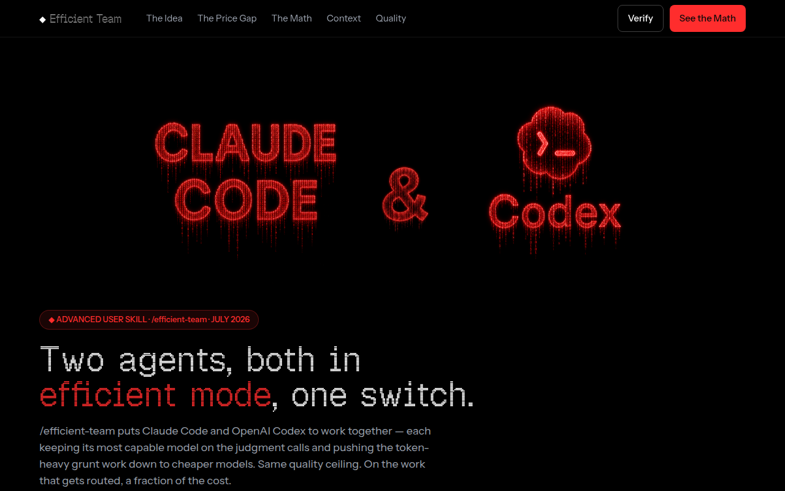
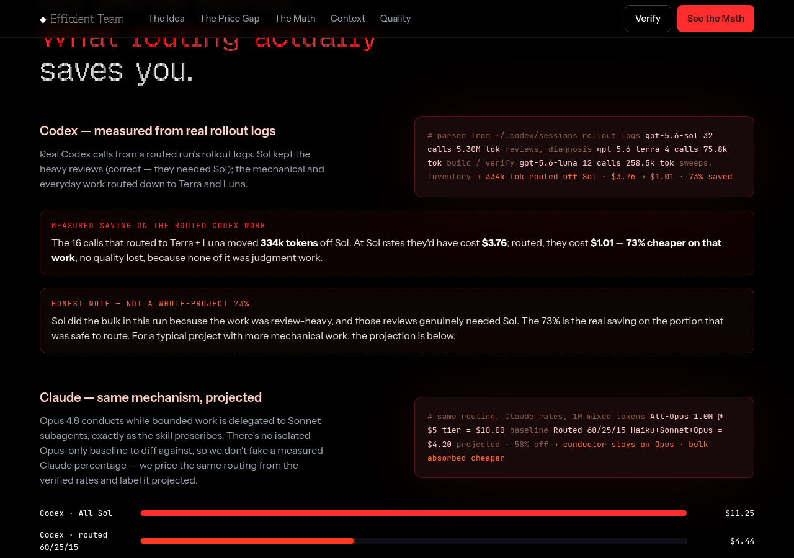

# efficient-team



Run OpenAI Codex and Anthropic Claude together, and route **every** call — on both sides — to
the cheapest model tier that can actually do the job. Same output, a fraction of the token
cost. Three skills plus a portable wrapper, all in one repo, one install.

- **`efficient-codex`** (Codex skill) — routes each Codex call to a GPT-5.6 tier: mechanical
  sweeps → `gpt-5.6-luna`, everyday engineering → `gpt-5.6-terra`, architecture / security /
  review → `gpt-5.6-sol`. The model is chosen **at invocation** (caller-routed).
- **`efficient-opus`** (Claude Code skill) — the Claude-side equivalent: Opus (or any premium
  model) conducts while cheaper subagents (Haiku / Sonnet) absorb the token-heavy work, with
  effort right-sized per task.
- **`efficient-team`** (Claude Code skill) — one command that turns on both disciplines at
  once: loads `efficient-opus` for the Claude session and has Claude route every Codex call it
  makes to the right tier.
- **`codex-route`** (`bin/`) — a portable wrapper: `codex-route --luna|--terra|--sol "task"
  [-C dir]` runs `codex exec` on that tier. Self-contained, no dependencies beyond the Codex CLI.

## What it does

Coding agents bill by the token, and in real agentic work **most tokens are input** — the files
they read, the tool output they get back, the logs they scan. Every one of those tokens bills at
whatever model is running. If your agent runs its flagship model for everything, you pay flagship
rates to read a file or run a test — work that needed no flagship judgment at all.

This package fixes that on **both** of the coding agents you're likely using:

- **On OpenAI Codex** — `efficient-codex` routes each Codex call to the cheapest GPT-5.6 tier that
  can do it. Mechanical sweeps go to **Luna** (5× cheaper than the flagship), everyday engineering
  to **Terra** (2× cheaper), and only genuine judgment (architecture, security, review) to **Sol**.
- **On Anthropic Claude (Claude Code)** — `efficient-opus` keeps your premium model (Opus, or any
  flagship) as the **conductor** making the decisions, and pushes the token-heavy grunt work down to
  **Sonnet** and **Haiku** subagents. The expensive model thinks; cheap models absorb the reading.
- **Both at once** — `efficient-team` is one command that turns on both disciplines together, so a
  session using Claude and Codex side by side routes *every* call, on *both* sides, to the right tier.

Same quality ceiling (the capable model still makes every judgment call). On the work that gets
routed, a fraction of the cost.

## Why it saves money — the numbers

**Codex side.** Sol bills $5/$30 per Mtok — 2× Terra ($2.50/$15), 5× Luna ($1/$6). Route a
mechanical sweep to Luna instead of Sol and those tokens bill 5× cheaper for identical output.

**Claude side.** Opus 4.8 bills $5/$25 per Mtok — ~1.7× Sonnet ($3/$15), 5× Haiku ($1/$5). Keep
Opus conducting but let Sonnet/Haiku subagents absorb the file reads, log scans, and rote edits,
and the bulk of your tokens bill at 1.7–5× cheaper while the quality-critical decisions stay on Opus.

A worked example on a 1M-token, 60/25/15 mix (cheap / mid / flagship) at July-2026 rates:

| Agent | All-flagship | Routed 60/25/15 | Saving |
|---|---|---|---|
| **Codex** (Sol / Terra / Luna) | $11.25 | $4.44 | ~61% |
| **Claude** (Opus / Sonnet / Haiku) | $10.00 | $4.20 | ~58% |



**Honest scope of the saving.** The per-token ratio (2×/5× on Codex, 1.7×/5× on Claude) is the
guaranteed part. End-to-end savings on a real task depend on the workload mix — how much is
genuinely mechanical vs judgment, plus flagship review passes and re-runs. The honest claim is
"route each call to the cheapest capable tier; savings vary by workload," not a fixed multiple. The
figures above pair one **measured** Codex run (73% saved on the routed portion) with the projected
Claude numbers, labeled as such.

## Requirements

- **Codex side:** Codex CLI **0.144+** (GPT-5.6 models are rejected by older builds with an
  HTTP 400).
- **Claude side:** Claude Code (for `efficient-opus` / `efficient-team`). The `efficient-opus`
  skill is bundled here — nothing external to install.

## How routing works on this build (tested 2026-07-14, CLI 0.144.4)

The routing lever is **the model chosen when Codex is invoked** (`codex exec -m
gpt-5.6-<tier>`), verified in the rollout log's `turn_context.payload.model`. What does *not*
work on 0.144.4, confirmed with unique fingerprint tokens in agent files:

- `~/.codex/agents/*.toml` per-agent **model/effort pins do not take effect** — a spawned
  subagent inherits the main thread's `gpt-5.6-sol`/high regardless of the pin.
- `config.toml [agents.<name>]` model registry — **did not change the spawned model**.
- `spawn_agent` tool `model` argument — **not in the declared schema**; works
  nondeterministically (sometimes the orchestrator refuses to send it).
- `~/.codex/agents/default.toml` — this one file *does* apply, but it forces ONE model on
  **every** subagent in **every** session machine-wide, including judgment-sensitive work.
  Documented as an advanced global override only, not the mechanism here.

So autonomous in-session Sol-led delegation with a per-task model mix is not reliable on this
build. This matches OpenAI's own `use_agent_identity` / `enable_fanout` flags still being
"under development." The `examples/agents/*.toml` files are role/instruction documentation and
forward-compat for when file pinning ships — they are **not installed**.

## Install

```bash
./install.sh            # no-clobber; --force to overwrite
./install.sh --agents-compat   # also mirror the skill to ~/.agents/skills/
```

Installs all three skills (`efficient-codex` → `~/.codex/skills/`, `efficient-opus` +
`efficient-team` → `~/.claude/skills/`) and `codex-route` → `~/.local/bin`. If `~/.local/bin`
isn't on your `PATH`, the installer says so and prints the line to add. `./uninstall.sh`
reverses it (only removing files that still match this package's source).

## Use

Route one call to a tier:

```bash
codex-route --luna  "inventory every file importing db.py" -C ~/proj
codex-route --terra "implement the /health route per SPEC"  -C ~/proj
codex-route --sol   "adversarial review of this auth diff"  -C ~/proj --xhigh
```

Or in Codex directly: `codex exec -m gpt-5.6-terra -c model_reasoning_effort='"medium"' "…"`.

Claude Code: `/efficient-team` to enable both halves; "efficient team off" to disable. While
on, Claude picks the tier per Codex call.

## Verify a route took effect

Don't trust a model's self-report of its name. The test reads the structured model field from
the rollout log, fail-closed:

```bash
./test/run-tests.sh          # static + deterministic tier-flag matrix (no tokens)
./test/run-tests.sh --live   # real --luna and --terra calls; verifies the rollout log
                             # turn_context.payload.model shows the right tier
```

## Layout

```text
skills/efficient-codex/SKILL.md   Codex-side tier routing policy
skills/efficient-opus/SKILL.md    Claude-side subagent routing policy
skills/efficient-team/SKILL.md    one-switch combiner (+ routing table)
bin/codex-route                   portable tier-routing wrapper
examples/agents/*.toml            role docs / forward-compat (NOT installed)
install.sh / uninstall.sh
test/run-tests.sh
```

Pricing, the effort ladder, and the caller-routed mechanism verified against provider docs and
live Codex 0.144.4 rollout logs on 2026-07-14. Re-verify pricing before quoting later. Sibling
project: efficient-fable (Claude Code, Fable main loop).

## License

Code is MIT (see `LICENSE`). The README preview images were rendered with the GeistPixel font
(SIL Open Font License 1.1) — credited in `NOTICE`; the font itself is not redistributed here.
